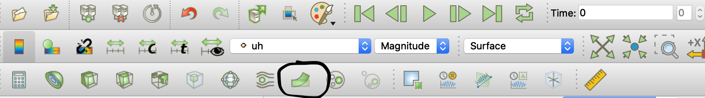
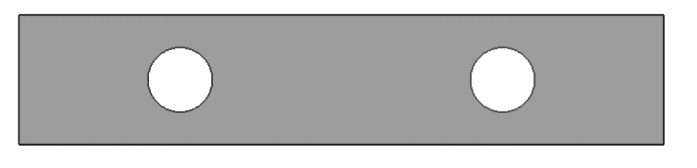
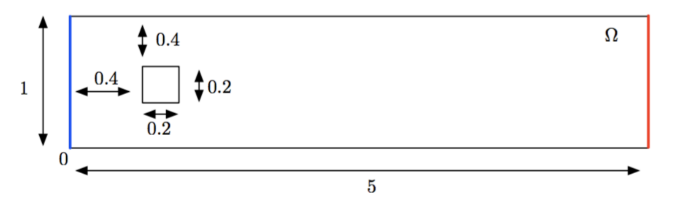

:feelpp: Feel++
= TP Mécanique des Solides et Mécanique des Fluides
:stem: latexmath

TIP: pour lire ce document en html, ouvrir le fichier `README.html` dans le repository.

== Elasticité Linéaire

=== Partie 1

On considère le domaine suivant soit stem:[\Omega=\]0, L[\times \] 0,1[ ] et l'on note stem:[\Gamma_{i}] les quatre côtés du bord, numérotés dans le sens inverse des aiguilles d'une montre et avec stem:[\Gamma_{1}] le bord du bas. 

Le problème d'élasticité linéaire s'écrit:
[stem]
++++
\begin{aligned}
\nabla \cdot \sigma(u) &=f \mbox{ dans } \Omega\\
\sigma(u) &=2 \mu \varepsilon(u) + \lambda(\nabla \cdot u) \mathrm{Id}\\
u&=0 \mbox{ sur } \Gamma_{1} \\
\sigma(u) n& =0 \mbox{ sur } \Gamma_{2} \cup \Gamma_{3} \cup \Gamma_{3}
\end{aligned}
++++
avec stem:[\lambda, \mu] les coefficients de Lamé

. Créer le maillage du domaine stem:[\Omega].
. Ecrire la formulation variationnelle, puis mettre en place la configuration pour {feelpp} en prenant pour données stem:[f=(0,1)^{T}] et stem:[\mu=\lambda=1]
. Visualiser la déformation du maillage obtenue à l'aide la fonction WarpByVector

. Ajouter sur le maillage déformé la visualisation  de la norme de Frobénius du tenseur des contrainte stem:[\sigma(u)] ainsi que des champs Von-Mises et Tresca. Commenter en vous aidant d'une petite recherche sur les champs précédents (Von-Mises...) par exemple sur Wikipedia.

=== Partie 2: Perte de coercivité. 

On ajoute à présent deux trous circulaires dans le domaine précédent.

.Poutre trouée

On fixe la poutre sur les bords gauche et droite et on la pince: on exerce donc une pression constante
sur le bord du bas (force dirigée vers le haut) et sur le bord du haut (force dirigée vers le bas).

. Créer le maillage et la configuration {feelpp} associé au problème.
. Comparer les solutions obtenues avec stem:[\lambda / \mu=1] et stem:[\lambda / \mu=10^{3} .] Afficher les lignes de niveau associé au déplacement vectical stem:[u_{2} .] À cette fin, on utilisera le préconditionneur diagonal (Jacobi) `--solid.pc-type jacobi` et on affichera les itérations `--solid.ksp-monitor=1`. Commenter.

== Stokes

=== Partie 1: Eléments finis stables. 

On considère le problème de Stokes suivant:
[stem]
++++
\begin{aligned}
-\Delta u+\nabla p &=f \text{ dans } \Omega \times \mathbb{R}^{+} \\
\nabla \cdot u &=0 \\
u&=g \text{ sur } \partial \Omega \times \mathbb{R}^{+}
\end{aligned}
++++

Une solution exacte est donnée par la solution de Kovasznay:
[stem]
++++
u=\left[\begin{array}{c}
1-e^{\lambda x} \cos (2 \pi y) \\
\frac{\lambda}{2 \pi} e^{\lambda x} \sin (2 \pi y)
\end{array}\right], \quad p(x, y)=-\frac{e^{2 \lambda x}}{2}+C
++++
avec stem:[\lambda=1 /(2 \nu)-\sqrt{1 /\left(4 \nu^{2}\right)+4 \pi^{2}}, C \in \mathbb{R}] une constante et le second membre stem:[f] est déterminé de telle sorte que stem:[u] soit solution.

On considère le domaine stem:[\Omega=(-0.5,1) \times(-0.5,1.5)] et stem:[\nu=0.035 .] 
Les conditions de Dirichlet sur le bord sont obtenues en évaluant la solution exacte.

. Déterminer stem:[f] de telle sorte que stem:[u] soit solution puis stem:[C \in \mathbb{R}] tel que stem:[p] soit à moyenne nulle sur stem:[\Omega].
. Créer le maillage du domaine stem:[\Omega].
. Ecrire la formulation variationnelle pour le problème suivant:
[stem]
++++
\begin{aligned}
-\Delta u+\nabla p&=f, \quad \text{dans} \Omega\\
\nabla \cdot u &=0 \\ 
u &=g \text{ sur } \partial \Omega
\end{aligned}
++++

. Considérer les éléments stem:[P_{2} / P_{1}] et calculer la moyenne de la pression. Commenter.
. Faire une analyse de convergence en vitesse et pression pour les éléments stem:[P_{2} / P_{1}].

=== Partie 2: Navier-Stokes instationnaire. 

On considère le problème suivant
[stem]
++++
\begin{aligned} 
\partial_{t} u + ( u \cdot \nabla ) u -\nu \Delta u+\nabla p &=f, & & \text { dans } \Omega \times[0, T] \\ 
\nabla \cdot u &=0 & & \\ 
u &=g_{D}, & & \operatorname{sur} \Gamma_{i n} \times[0, T] \\ 
u &=0, & & \operatorname{sur} \Gamma_{0} \times[0, T] \\ 
\nu \partial_{n} u-p n &=g_{N}, & & \operatorname{sur} \Gamma_{o u t} \times[0, T] \\ 
u(0, x) &=u_{i n i t}(x), & & \operatorname{sur} \Gamma 
\end{aligned}
++++
où 

* stem:[u: \Omega \times[0, T\] \rightarrow \mathbb{R}^{2}] est le champ de vitesse, 
* stem:[p: \Omega \times[0, T\] \rightarrow \mathbb{R}] la pression. 

Le bord du domaine est décomposée en 3 partie stem:[: \partial \Omega=\Gamma_{i n} \cup \Gamma_{\text {out}} \cup \Gamma_{0}].

. Effectuer une semi-discrétisation en temps et écrire le problème variationnel. On approchera stem:[u^{n+1}\cdot \nabla u^{n+1}] par stem:[u^{n}\cdot \nabla u^{n+1}].

On considère le domaine suivant

* Sur la partie bleue du bord stem:[\left(\Gamma_{i n}\right),] on impose un profile de vitesse parabolique stem:[ g_{D}(x, y)=(4 y(1-y), 0)^{T}] 
* Sur les parties noires du bord stem:[\left(\Gamma_{0}\right),] on impose des conditions de Dirichlet homogène : stem:[g_{D}(x, y)=(0,0)^{T}] 
* Sur la partie rouge du bord (stem:[\Gamma _{\text {out}}] ) aucune contrainte n'est exercée (sortie libre): cela correspond à des conditions de type Neumann homogène : stem:[g_{N}(x, y)=(0,0)^{T} .] 
* Enfin, aucune force extérieure n'est exercée
sur le fluide : stem:[f=0] 

La donnée initiale est donnée par:
[stem]
++++
u_{i n i t}(x, y)=\left\{\begin{array}{ll}
(4 y(1-y), 0)^{T}, & \text { si }(x, y) \in \Gamma_{i n} \\
(0,0)^{T}, & \text { sinon. }
\end{array}\right.
++++
et les paramètres sont stem:[\nu=0.05] et stem:[T=10s.]

[start=2]
. Programmer la méthode avec la toolbox fluid(CFD) en mode Navier-Stokes
. Calculer le trainée et la portance(les composantes de la force qui s'applique sur l'obstacle), les afficher et commenter
. Diminuer la viscosité du fluide(prenez quatre valeurs différentes stem:[5e-3, 5e-4, 1e-4, 5e-5]), qu'observez vous ? Commenter en introduisant le nombre de Reynolds stem:[Re=\frac{\rho U L}{\nu}] avec stem:[\rho=1, U=1, L=0.4] et en vous documentant sur ce dernier.
. Calculer le trainée et la portance(les composantes de la force qui s'applique sur l'obstacle), les afficher et commenter

TIP: la force qui s'applique sur l'obstacle peut être calculée via l'étape de postprocessing de {feelpp}, voir http://docs.feelpp.org/toolboxes/0.108/cfd/toolbox/#_post_processing[ici].

Vous utiliserez ce fichier de configuration comme base pour vos différentes simulations

.fichier de configuration cfd.cfg
[source,ini]
----
directory=toolboxes/fluid/flow_past_square/cfd3/P2P1G1

[case]
dimension=2

[fluid]
filename=$cfgdir/cfd3.json

mesh.filename=$cfgdir/cfd.geo
gmsh.hsize=0.03
linearsystem-cst-update=false
jacobian-linear-update=false
solver=Oseen #Oseen,Picard,Newton
pc-type=lu #gasm,lu

[fluid.bdf]
order=2
#strategy-high-order-start=1

[ts]
time-step=0.01
time-final=10
#restart=true
restart.at-last-save=true
#time-initial=0.0002
#save.freq=2
----

la ligne de commande :
----
mpîrun -np 4 feelpp_toolbox_fluid --config-file cfd.cfg
----

== Execution des codes 

Vous pouvez travailler sous vscode avec container ou bien sur atlas.math.unistra.fr.

=== VSCode/Docker

Concernant VSCode/Docker, afin d'accéder à vos résultats:

* lancer un terminal sous vscode. le répertoire dans lequel vous êtes est accessible depuis l'extérieur (et donc eg paraview pour la visu).
* taper la commande
-----
export FEELPP_REPOSITORY=$PWD
-----

=== VSCode Atlas

Concernant la connection à atlas.math.unistra.fr,
vous avez eu un compte créé lors du S1 qui est toujours ouvert.
Vous vous connectez sur ce compte via https://services-numeriques.unistra.fr/documentations/toutes-les-documentations/services-au-poste-de-travail/acces-distants-securises-vpn.html[VPN].

une fois la connection vpn en place, créer une connection remote-ssh via vscode sur atlas.math.unistra.fr ou bien connectez vous via ssh.

==== Module {feelpp}

Pour accéder aux applications {feelpp}, tapez
----
module load feelpp-toolboxes/develop_gcc830_openmpi402
----

Les applications `feelpp_toolbox_fluid` et `feelpp_toolbox_solid` sont à présent disponibles.

`git` est disponible et vous pourrez cloner votre repo du TP sur Atlas.

==== Visualisation

Nous n'avons pas encore d'outils de visualisation à distance, pour visualiser les résultats il vous faut 
rapatrier les résultats de calculs sur votre machine et les visualiser avec paraview.
Pour cela, utilisez `rsync` qui ne va rapatrier que les fichiers qui ont été modifiés

.Ligne de commande avec rsync pour rapatrier les données
----
rsync -avz <votre login>atlas.math.unistra.fr:~/feel $HOME/
----

Cette commande va créer le répertoire `$HOME/feel` et va télécharger les fichiers depuis la dernière commande `rsync`.

Pour visualiser le contenu de fichier CSV (les mesures de force par exemple) vous pouvez utiliser excel, google/spreadsheet, python/matplotlib ou paraview. 
En abcisse le temps en ordonnée la série que vous désirez observer.
